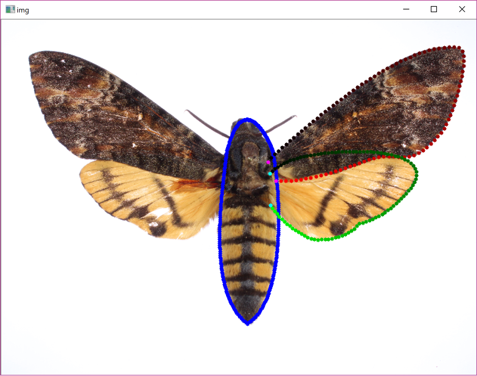
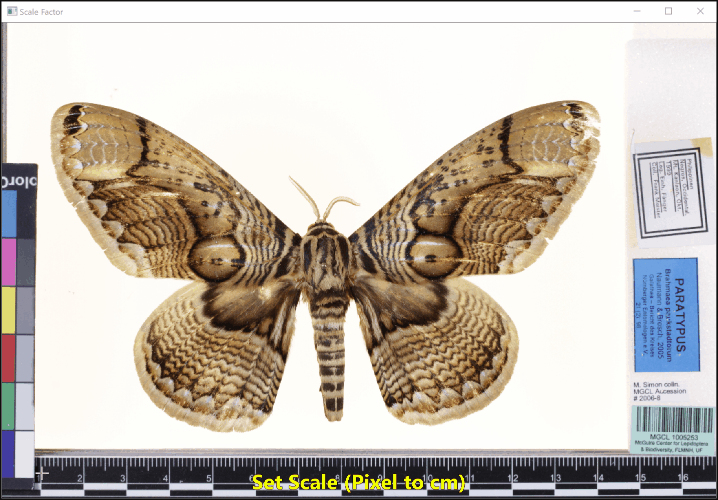

# Mothra

An app for obtaining the wing and body outlines from moth museum specimens. Written in 2018.

## Demo

## Technologies Used
* Python
* NumPy
* OpenCV
* [fitCurves](https://github.com/volkerp/fitCurves)

## License

The code in this project is licensed under the MIT License.